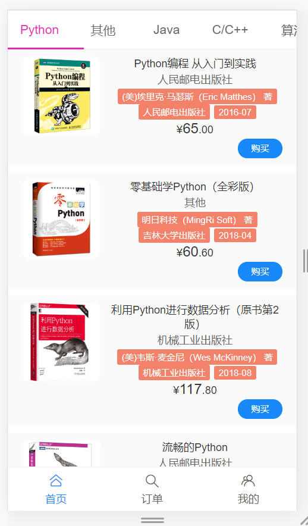
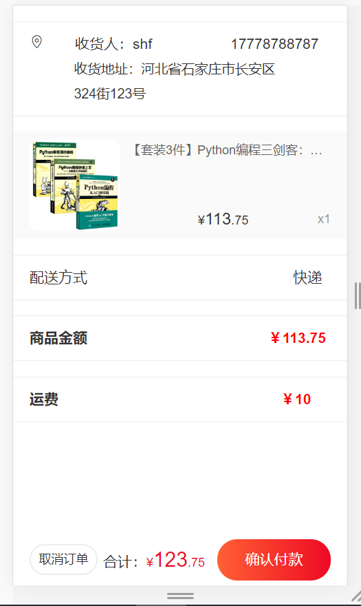

# book_store_demo

 一个使用Vue和Vant UI编写的移动端图书商城的前端界面，对应后端服务地址：https://github.com/ekesaiting/book_store_demo_springboot

> 参考：https://github.com/southwind9801/phone_store_demo_vue

# 主要使用的技术与框架

***Vue+Vant+Axios***

# 效果演示






## Project setup

```
npm install
```

### Compiles and hot-reloads for development
```
npm run serve
```

### Compiles and minifies for production
```
npm run build
```

### Customize configuration
See [Configuration Reference](https://cli.vuejs.org/config/).
